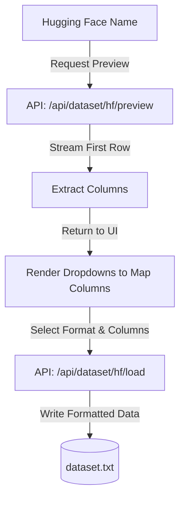

# 🌌 LUMINA GPT

<div align="center">

[](https://www.python.org/)
[](https://pytorch.org/)
[](https://flask.palletsprojects.com/)
[](https://huggingface.co/)
[](https://opensource.org/licenses/MIT)
[](https://github.com/apexvoidd/lumina/pulls)

**Train, test, and package your own custom Generative Pre-trained Transformer (GPT) model directly in your browser.**

[Key Features](#-key-features) • [Installation](#-quick-start) • [Dataset Pipeline](#-dataset-mapping-pipeline) • [Authentication](#-getting-a-hugging-face-token) • [Contributing](#-contributing)

</div>

---

## 📖 About Lumina
Lumina is an **open-source, end-to-end GPT training and companion playground** written from scratch in PyTorch. It bridges the gap between complex deep learning models and interactive visual interfaces. 

Whether you want to train a custom chatbot on dialogue scripts or pretrain a language model to autocomplete raw text (like books or articles), Lumina gives you absolute control over parameters, dataset mappings, and inference—all packaged in a beautiful, responsive web interface.

> [!NOTE]  
> **Lumina is 100% open-source and modular.** It is built as a prototype for learning, tinkering, and building. We welcome contributions, custom features, optimizations, and issues!

---

## 🌟 Key Features

### 🧠 1. Custom GPT Architecture from Scratch
Coded completely from scratch in [model.py](file:///c:/Users/ayush/Downloads/New%20folder%20(2)/scratch-voice-gpt/model.py):
- **Causal Multi-Head Self-Attention** with casual masking to prevent attending to future tokens.
- **Learnable Positional Embeddings** and Layer Normalization.
- Adjust model dimensions on the fly (Embedding dimensions, Attention Heads, layers) directly in the UI before starting.

### 📊 2. Real-Time Web Dashboard
- Live training loss chart powered by **Chart.js** updating every few iterations.
- Iteration-per-second speed indicators and progress trackers.
- **Smart Training Resumption**: Stops and restarts training on weights checkpoints instantly, preserving previous training curves on the graph.
- **Start Fresh Toggle**: Wipes existing weights and vocabs for a model in a single click to start from scratch.

### 📂 3. Universal Dataset Loader & Config Selector
- **Hugging Face Hub Integration**: Type any dataset name. The backend streams a single-row preview, detects all columns, and provides subset/configuration selectors if the dataset contains multiple configs.
- **Drag & Drop Local Upload**: Upload custom `.txt` files containing dialogue logs or plain text articles.

### 💬 4. Voice Companion Chat
- Autonomously generates responses from your custom-trained weights.
- Features integrated **Text-to-Speech (TTS)** and **Speech-to-Text (STT)** to chat with the model using voice.
- **Adaptive AI Mood Detector**: Evaluates generated text to set the AI's emotional vibe (Calm, Thoughtful, Excited, Empathetic) reflected in a breathing, colorful UI orb.

### 📦 5. Standalone Model Exporter
- Export your trained model in a single zip package. 
- Includes a `standalone.flag` which disables the developer training console and launches the app directly into a full-screen, clean chat companion application.

---

## 🛠️ Quick Start

### 1. Prerequisites
Ensure you have Python 3.8 or higher installed on your system.

### 2. Installation
Clone this repository and install the dependencies:
```bash
# Clone the repository
git clone https://github.com/apexvoidd/lumina.git
cd lumina

# Install dependencies
pip install torch flask datasets
```

### 3. Run the App
Launch the Flask backend server:
```bash
python server.py
```
Open your browser and navigate to **[http://127.0.0.1:5000](http://127.0.0.1:5000)**.

---

## 🔀 Dataset Mapping Pipeline

Lumina processes Hugging Face datasets into text sequences depending on the structure you choose:



### Supported Formats
| Format | Description | How It Trains | Best For |
|---|---|---|---|
| **Prompt / Response Pairs** | Maps two separate columns (e.g. `instruction` & `output`) | Formatted as alternating `User:` / `AI:` turns | Q&A datasets, instruction tuning |
| **Dialogue Turn List** | Maps one column containing lists of conversations | Iterates through the list, assigning odd entries to `User` and even to `AI` | Alternating dialogue transcripts |
| **Raw Text Lines** | Maps one column containing raw transcripts | Splits the text block by newlines, pairing consecutive lines as exchanges | Movie scripts, screenplays |
| **Plain Text** | Maps a raw text column directly into a continuous file | Auto-detected during training. Tokenizes the text into a continuous sequence (no conversation templates) | Autocomplete, pretraining on articles/books |

---

## 🔑 Getting a Hugging Face Token

A token is only necessary for private or gated Hugging Face datasets. To obtain one:
1. Create a free account at [Hugging Face](https://huggingface.co/).
2. Navigate to your **Settings** (click your profile photo in top-right).
3. Select **Access Tokens** in the sidebar.
4. Click **New token**, name it, assign the **Read** role, and click **Generate**.
5. Copy the token and paste it directly into the token input field in the Lumina dashboard.

---

## 🤝 Contributing

Lumina is open source, and we value community contributions! 
1. **Fork** the repository.
2. Create a new branch (`git checkout -b feature/amazing-feature`).
3. **Commit** your changes (`git commit -m 'Add some amazing feature'`).
4. **Push** to your branch (`git push origin feature/amazing-feature`).
5. Open a **Pull Request** and describe your improvements!
